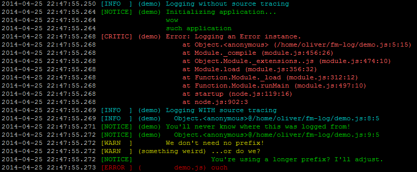

fm-log
======
[](https://travis-ci.org/hartwig-at/fm-log)
[](https://coveralls.io/github/hartwig-at/fm-log?branch=master)


What?
-----
Straight-forward logging module.

- lines up everything in nice columns
- uses colors
- sends everything straight to `process.stdout` (no events, no `nextTick()`) if desired
- condenses repeated messages
- displays stack traces for logged Error instances and other multi-line content nicely
- optionally displays the source of the logging call
- supports wrapping of [morgan](https://github.com/expressjs/morgan) in your express app
- can replace the [debug](https://github.com/visionmedia/debug) module, using [hartwig-at/debug](https://github.com/hartwig-at/debug)

Example
-------

```js
var log = require( __dirname + "/lib/log.js" ).module( "demo" );

log.info( "Logging without source tracing" );
log.notice( "Initializing application...\nwow\nsuch application" );
log.critical( new Error( "Logging an Error instance." ) );

log.withSource();
log.info( "Logging WITH source tracing" );
log.notice( "You'll never know where this was logged from!" );

log = require( __dirname + "/lib/log.js" );
log.warn( "We don't need no prefix!" );

log = require( __dirname + "/lib/log.js" ).module( "something weird" );
log.warn( "...or do we?" );

log = require( __dirname + "/lib/log.js" );
log.notice( "You're using a longer prefix? I'll adjust." );

log = require( __dirname + "/lib/log.js" ).module();
log.error( "ouch" );
```



```js
// Wrap morgan
app.use( require( "fm-log" ).module( "HTTP" ).morgan( {format : "dev"} ) );
```

How?
----

Install
```shell
npm install fm-log
```

Put this in every file where you want to log:
```js
var log = require( "fm-log" ).module();
```

Then just use `log.info` or one of the other logging levels shown above.

For loggers without a specific prefix, just `require()` the module and use it directly:
```js
var generic = require( "fm-log" );
generic.notice( "We don't need no prefix" );
```

To log to a different stream (`process.stdout` is the default), use `.to()`:
```js
var logger = require( "fm-log" ).to( process.stderr );
```

To send data straight to the output stream (without `nextTick()`), use `.sync()`:
```js
var logger = require( "fm-log" ).sync();
```
